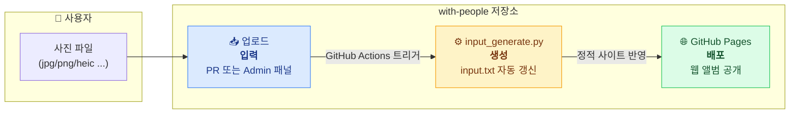
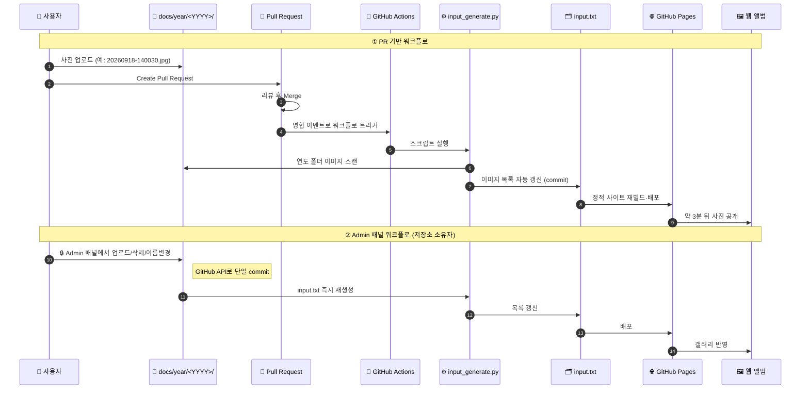

# with-people
Photo collection to archive memorable recollection in my life.

<li><a href=https://leemgs.github.io/with-people/>https://leemgs.github.io/with-people/</a></li>


# 한눈에 보기 (At a Glance)

**with-people** 는 코딩 없이 **GitHub 무료 리소스만으로** 연도별 사진을
관리·전시하는 자동화된 웹 앨범 시스템입니다. 사용자는 사진을 연도 폴더에
올리기만 하면 되고, 나머지(목록 갱신·페이지 생성·배포)는 전부 자동으로
처리됩니다.



| 구성 요소 | 역할 | 설명 |
|---|---|---|
| `docs/year/<YYYY>/` | 📥 입력 | 연도별 사진 폴더 — 여기에 이미지를 올립니다 |
| `input_generate.py` | ⚙️ 생성 | 폴더 내 이미지를 스캔해 `input.txt` 목록을 자동 생성 |
| `.github/workflows/` | 🤖 자동화 | PR 병합 후 생성 스크립트를 실행하는 GitHub Actions |
| `docs/` (GitHub Pages) | 🌐 배포 | 갤러리 웹사이트를 공개 URL로 서빙 |
| `docs/admin.js` | 🔒 관리 | 브라우저에서 연도 생성·사진 관리 (저장소 소유자용) |

> **핵심 원칙:** 사용자는 **사진 업로드**만 하면 됩니다. 목록 갱신·페이지
> 렌더링·배포는 모두 자동화되어 있어, 약 3분 뒤 웹 앨범에 사진이 나타납니다.


# 데이터 흐름 / 동작 흐름 (Data / Operation Flow)

사진 한 장이 업로드된 뒤 웹 앨범에 노출되기까지의 전체 흐름입니다.
경로는 크게 **① PR 기반 워크플로**와 **② Admin 패널 워크플로** 두 가지가
있으며, 두 경로 모두 결국 `input.txt` 갱신 → GitHub Pages 배포로 수렴합니다.



**흐름 요약**

1. **입력** — 사용자가 `docs/year/<YYYY>/` 폴더에 지원 형식의 이미지를 올립니다.
2. **트리거** — PR 병합(또는 Admin 패널의 커밋)이 GitHub Actions를 깨웁니다.
3. **생성** — `input_generate.py` 가 폴더를 스캔해 `input.txt` 이미지 목록을 자동 갱신합니다.
4. **배포** — GitHub Pages가 `docs/` 를 재빌드하여 공개 URL로 서빙합니다.
5. **열람** — 약 3분 뒤, 방문자는 연도별 웹 앨범에서 새 사진을 확인합니다.


# Getting Started

This project provides a web album system that allows users to easily manage their yearly photos automatically, without any coding, using free GitHub resources. Users only need to submit a Pull Request (PR) uploading their photos to year-specific folders. Once the PR is merged, all the necessary work for displaying the photos on the website is performed automatically.

## Supported image formats

The gallery supports a wide range of image formats (case-insensitive):

`*.jpg`, `*.jpeg`, `*.png`, `*.gif`, `*.bmp`, `*.webp`, `*.svg`, `*.tif`, `*.tiff`, `*.heic`, `*.avif`

Here's the simple procedure for users:

1. Let's assume you have a photo taken with your camera, named 20260918-140030.jpg (or any supported format such as 20260918-140030.png).
2. Upload this image file to the ./docs/year/2026/ folder.
3. Click the "Create a Pull Request" button.
4. After review, click the "Merge a Pull Request" button to merge the uploaded PR.
5. That's it! In about 3 minutes, when you access the website, you'll see your uploaded photo displayed in your web album.

This easy process allows you to maintain and showcase your yearly photo collections effortlessly through a simple GitHub workflow.

## Project layout

The published website lives under [`docs/`](docs/) (served by GitHub Pages),
while build tooling stays at the repository root:

```
docs/                     ← the website (GitHub Pages root)
  index.html/.css/.js     ← landing page (Linux Mint file-manager UI)
  admin.js                ← browser admin panel (see below)
  year/
    template.html         ← reusable, year-agnostic album page
    2009/ … 2026/         ← one folder per year: <YYYY>.html + input.txt + images
input_generate.py         ← regenerates input.txt for a year folder
.github/workflows/        ← auto-runs input_generate.py after a PR merge
```

> **GitHub Pages setting:** Settings → Pages → *Deploy from a branch* →
> branch `main`, folder **`/docs`**. Then the site is served at
> `https://leemgs.github.io/with-people/`.

## Admin panel (create years & manage photos from the browser)

Instead of editing files in the repo by hand, the site owner can click
**🔒 Admin** in the menu bar to:

1. **Connect** with a GitHub **fine-grained personal access token** scoped to
   this repository with **Contents: Read and write**. The token is stored only
   in your browser (`localStorage`) and is never committed — treat it like a
   password and don't use it on a shared computer.
2. **Create a new year** — pick a year (e.g. `2027`) from the dropdown; the
   folder, a copy of `year/template.html`, and an empty `input.txt` are
   committed for you.
3. **Manage photos** — upload, replace, delete, or rename images for a year.
   JPG, JPEG, and PNG uploads are automatically named from the browser file's
   modified time using `YYYYMMDD-HHMMSS.ext` (for example,
   `20260821-143232.jpg`). Review or correct the timestamp in the upload queue,
   then click **Upload selected**. The timestamp year must match the album.
   **Replace** updates the image while preserving its filename and published
   URL (the replacement must use the same extension). `input.txt` is
   regenerated automatically when the image list changes, and each action is
   a single commit via the GitHub API.

The classic PR-based workflow above still works; the admin panel is just a
faster path for the repository owner.
